<!-- banner -->
<p align="center">
  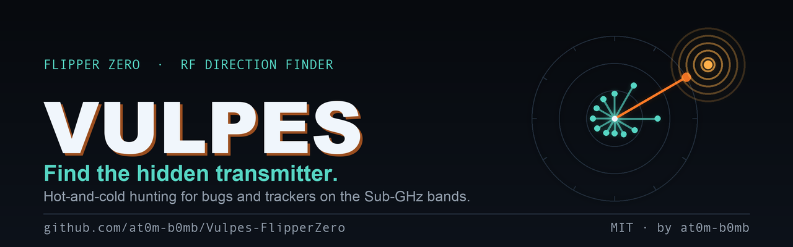
</p>

<h1 align="center">Vulpes 🦊</h1>
<p align="center"><i>Find the hidden transmitter.</i></p>

<p align="center">
  
  
  
  
  
  
</p>

<p align="center">
  In radio direction finding the hidden transmitter is called <b>the fox</b>, and looking for it is
  a <b>fox hunt</b>. <b>Vulpes</b> is the fox hunt, on your Flipper. It sweeps the Sub-GHz bands to
  show you what is actually transmitting around you, then turns the Flipper into a
  <b>hot-and-cold detector</b> that gets louder and faster as you close in — until you are standing
  on top of it.
</p>

<p align="center"><sub>A spectrum analyser tells you something is there. This walks you to it.</sub></p>

---

## 📟 On the Flipper

<p align="center">
  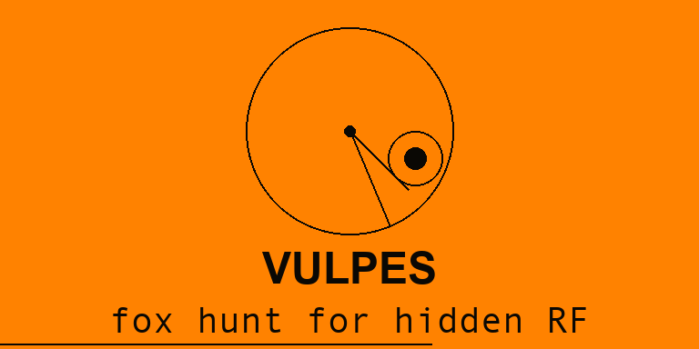
</p>
<p align="center">
  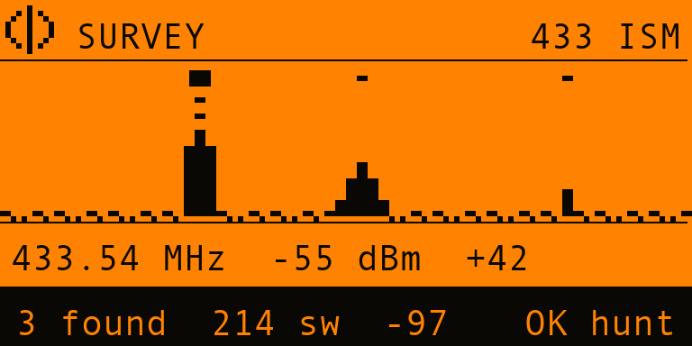
  &nbsp;
  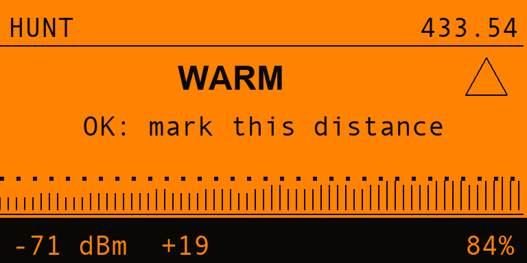
  &nbsp;
  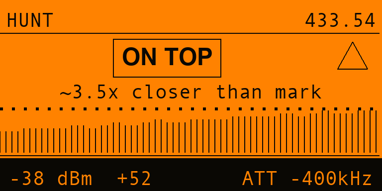
</p>
<p align="center">
  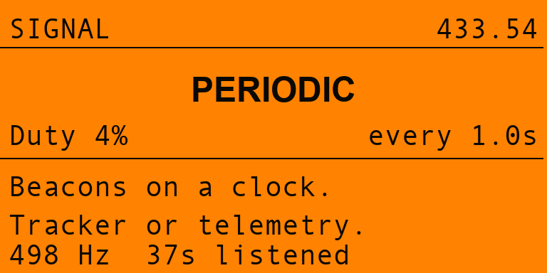
  &nbsp;
  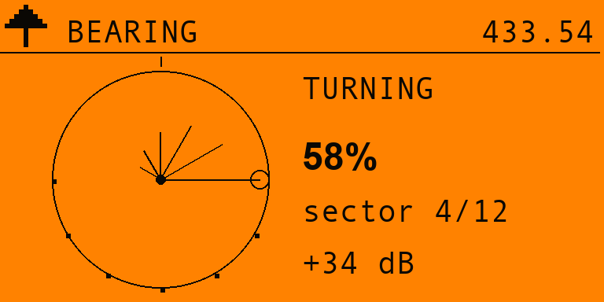
  &nbsp;
  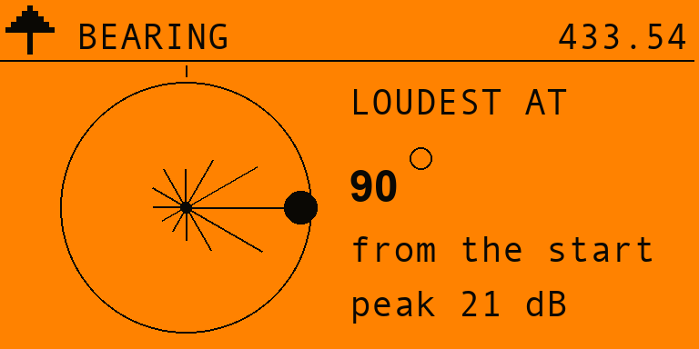
</p>
<p align="center">
  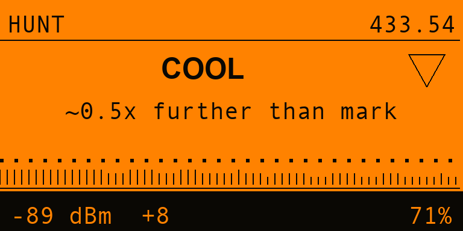
  &nbsp;
  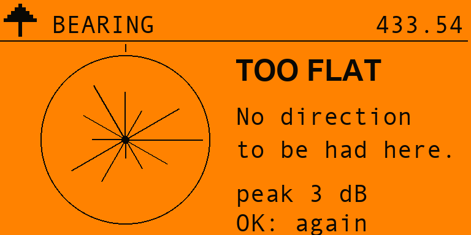
  &nbsp;
  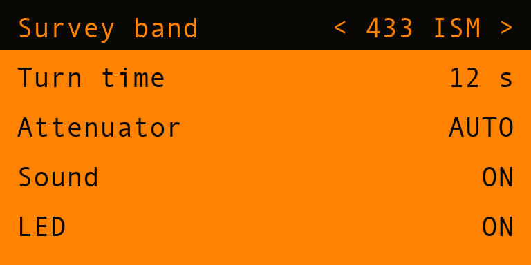
</p>
<p align="center">
  <sub><b>1. Survey</b> — what is transmitting &nbsp;·&nbsp; <b>2. Hunt</b> — warmer &nbsp;·&nbsp;
  <b>on top of it</b>, attenuator in &nbsp;·&nbsp; <b>Signal</b> — what kind of thing it is
  &nbsp;·&nbsp; <b>Bearing</b> — turning &nbsp;·&nbsp; and the answer &nbsp;·&nbsp;
  going <b>colder</b> &nbsp;·&nbsp; <b>too flat to call</b> &nbsp;·&nbsp; <b>Settings</b></sub>
</p>

---

## ✨ Features

- 🔭 **Survey finds what you did not know was there.** Sweeps a band in 64 steps and **max-holds
  across every pass**, so a tracker that keys up for 40 ms once a second is still caught — the
  sweep only has to get lucky once. Anything standing **10 dB over the band's own noise floor** is
  listed, strongest first, with neighbouring bins merged so one carrier is one candidate.
- 🔥 **Hunt is hot and cold, done properly.** `COLD → COOL → WARM → HOT → BURNING → ON TOP`, with a
  warmer/colder verdict that is a **least-squares fit over the last 0.6 seconds** — not a
  difference between two samples, which on a real signal is just noise wearing a hat.
- 🤫 **It shuts up when it does not know.** The trend has a deadband derived from **its own fit
  residual**, so a jittery signal has to work harder to claim a direction. A tool that flickers
  between WARMER and COLDER is worse than one that says nothing.
- 🔊 **Clicks that rise in pitch and rate.** You are looking at skirting boards and smoke alarms,
  not at the screen. The audio carries the reading on its own — a geiger counter for RF.
- 📏 **"~3.5x closer than mark".** Press OK to mark a spot; from then on it reports how much nearer
  you are, using the free-space law of **6 dB per halving of distance**.
- 🎚️ **An offset attenuator, in software, for free.** Inside a couple of metres the receiver
  saturates and a plain RSSI meter goes blind exactly where it should be sharpest. Vulpes tunes
  **deliberately off frequency** so the radio's own filter skirt knocks the signal down and the top
  of the scale works again — the trick fox-hunters do with a box of parts. Automatic or manual.
- 🧭 **Bearing turns your body into the antenna.** A whip hears equally in all directions, so one
  reading has no direction in it. Hold the Flipper to your chest and turn a slow circle: your torso
  shadows whatever is behind you, and the rose shows which way was loudest.
- 🧬 **It tells you what kind of thing it found.** `CONTINUOUS` (analog bug, video tx, jammer) ·
  `PERIODIC` (tracker, telemetry beacon, with the period in seconds) · `INTERMITTENT` (a remote,
  a sensor, a doorbell). This is what stops a neighbour's weather station reading as a bug.
- 🧾 **It admits when there is no answer.** `TOO FLAT` is a real result, and indoors a common one.
  Vulpes reports it rather than inventing a bearing out of a reflection.
- ⚙️ **Settings stick.** Band, turn time, attenuator mode, sound and LED survive a reboot.
- 🔌 **Zero extra hardware.** The onboard CC1101. Nothing to wire, nothing to flash.
- 🕶️ **Listen-only.** Vulpes **never transmits**.

---

## 🧠 How it works

### The problem with RSSI

The radio hands the app exactly one number: a received signal strength, once every couple of
milliseconds. Everything Vulpes claims is an interpretation of a stream of those numbers, and the
naive interpretations are all wrong in ways that matter:

| Naive approach | Why it fails | What Vulpes does |
|---|---|---|
| Average the samples | A bug keyed 25% of the time has a **bimodal** distribution. The mean lands in the empty gap between "off" and "on" and describes neither. | The signal level is the **7/8th percentile** of a 2.5 s window — high enough to ignore the gaps, low enough that one spike of interference cannot define it. |
| "Is it higher than last time?" | Sample-to-sample noise swamps the change from a step sideways. It says WARMER at random. | A **least-squares slope** over the last 16 updates, in dB per second, with a **deadband from the fit's own residual**. |
| Noise floor = the quiet percentile of the window | Stand on a continuous carrier and every sample *is* the carrier. The floor rises to meet it, the margin collapses, and the screen reads COLD while you are on top of the transmitter. | The floor is tracked over **time**, snaps down to any new minimum, and **stops updating entirely once samples run 10 dB above it** — you cannot measure a noise floor through a carrier. |
| Peak-hold on the band | One long look misses a beacon that speaks for 40 ms. | Sweep fast and **max-hold across passes**: 25 looks per second at every frequency in the band. |

### The three steps

**1 · Survey** — 64 frequency steps across the band, ~40 ms per sweep, max-held. The **band noise
floor is the lower quartile of the sweep** — robust, because most of a band is empty and a couple
of loud carriers cannot drag a quartile. Local maxima 10 dB above it become candidates, with ±2
bins suppressed around each so one transmitter smeared across the RX filter is one entry.

**2 · Hunt** — fixed frequency, ~500 samples/second. Every sample feeds a burst detector (with a
Schmitt trigger, so a signal grazing the threshold does not multiply one burst into a thousand);
every 20 samples a max-held value feeds the direction-finding track. The survey's band floor is
carried across as the starting noise estimate — a genuinely independent measurement, taken at 64
different frequencies rather than at the one the transmitter is sitting on.

**3 · Bearing** — you turn, the app bins by elapsed time into 12 sectors of 30°, keeping the
maximum in each. The result reports its own **peak-to-median contrast** and refuses to name a
direction below 6 dB or before you have walked at least 9 of the 12 sectors.

### The attenuator

The CC1101's RSSI saturates near −10 dBm. Close in, the reading pegs and stops moving. Vulpes
retunes 200/400/800 kHz off frequency so the receiver's own filter attenuates the signal and the
scale becomes usable again. Offsets are validated against the band edges — if neither direction is
legal, no attenuation is applied and the app says so rather than pretending.

When the step changes, **the entire measurement history is thrown away**. Left in place, the level
jump would read as a violent COLDER at exactly the moment you got closest.

---

## 🎮 Controls

| Screen | Key | Does |
|---|---|---|
| **Survey** | `↑` `↓` | Pick a candidate |
| | `←` `→` | Change band |
| | `OK` | Lock it and hunt |
| | `OK` (hold) | Clear the max-hold and start over |
| **Hunt** | `OK` | Mark this distance |
| | `OK` (hold) | Reset peak-hold and burst statistics |
| | `↑` `↓` | Attenuator step (switches to manual) |
| | `←` `→` | Switch between **Hunt** and **Signal** |
| **Bearing** | `OK` | Start a turn (or run another) |

---

## 🚀 Install

**From the release** — grab `vulpes.fap` from
[Releases](https://github.com/at0m-b0mb/Vulpes-FlipperZero/releases) and drop it in
`SD Card/apps/Sub-GHz/`. It appears under **Apps → Sub-GHz → Vulpes**.

**From source** — needs [`ufbt`](https://github.com/flipperdevices/flipperzero-ufbt):

```bash
python3 -m pip install --upgrade ufbt && ufbt update --channel=release && ufbt
```

Then `ufbt launch` with the Flipper plugged in, or copy `dist/vulpes.fap` across yourself.

---

## 🧪 Tests

The engine's reading of the RSSI stream *is* the product, and no screenshot can vouch for any of
it. So every threshold, boundary and degenerate input is checked on the host on every push:

```bash
make -C test
```

> `916 checks, 0 failures`

The tests are worth reading — they encode the failure modes above as regressions, including the one
that matters most: *a continuous carrier must not drag the noise floor up to meet it.*

---

## ⚠️ Honest limits

- **RSSI gives closer and further, never a distance.** The "×closer" figure assumes free space at
  6 dB per halving. Indoors, walls make that optimistic.
- **Reflections lie.** Metal and walls create real hot spots where nothing is. Confirm a find from
  two different places before you start unscrewing things.
- **`TOO FLAT` is common indoors** and is a result, not a failure.
- **300–348, 387–464 and 779–928 MHz only** — the CC1101's range. **No Wi-Fi, no Bluetooth, no
  2.4 GHz, no GSM, no cellular.** A modern GSM bug or a Wi-Fi camera is invisible to this.
- **It finds transmitters.** A camera recording to an SD card emits nothing to find.
- **The classification is a heuristic** from duty cycle and burst timing. It narrows the field; it
  does not identify a device.
- **Listen-only.** Vulpes never transmits, on any band.

---

## 📁 Layout

```
vulpes.c / vulpes_i.h     app shell, notification ladders
helpers/vul_df.{c,h}      the direction-finding engine  ← pure, host-tested, no Flipper deps
helpers/vul_radio.{c,h}   CC1101 worker: survey sweep + hunt loop + offset attenuator
helpers/vul_store.{c,h}   settings persistence
views/                    hunt (2 pages), survey, bearing, splash
scenes/                   start, survey, hunt, bearing, settings, about
test/                     host tests for the engine
tools_gen_*.py            icons, banner and mock screenshots (Pillow)
```

---

## 📜 Licence

MIT — see [LICENSE](LICENSE).

Built by [**at0m-b0mb**](https://github.com/at0m-b0mb). Part of a family of Flipper Zero
counter-surveillance tools: [Nyx](https://github.com/at0m-b0mb/Nyx-FlipperZero) finds hidden
cameras by the infrared they emit; **Vulpes** finds hidden transmitters by the RF they emit.

<p align="center"><sub>Use it on your own property, or where you have permission. Radio
regulations and privacy law vary; the responsibility is yours.</sub></p>
